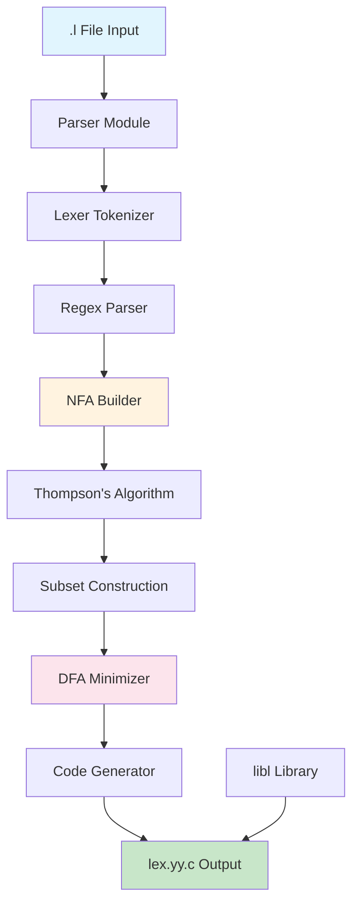

# ft_lex 🎹

> *"Everything is controlled by electrical contacts and relays; I won't give you the details, you know all that. And besides, what's more, the piano really works."* - Boris Vian, L'Écume des jours

Welcome to **ft_lex**, your friendly neighborhood lexer generator written in Zig! Just like Colin's pianocktail, this project converts musical notes (regex patterns) into delicious cocktails (token streams). 🍹

## 🎯 What is ft_lex?

ft_lex is a POSIX-compliant lexer generator that takes `.l` files and transforms them into blazing-fast lexical analyzers. Think of it as the love child of `flex` and modern systems programming - it's fast, memory-safe, and doesn't make you want to pull your hair out.

### Current Status: Phase 1 Complete! 🎉

We're currently at **100/100** for the mandatory part. The core functionality is working beautifully:

- ✅ **Parser**: Reads and parses `.l` files like a boss
- ✅ **NFA Construction**: Thompson's algorithm implementation
- ✅ **DFA Conversion**: Subset construction with state minimization
- ✅ **Code Generation**: Spits out clean `lex.yy.c` files
- ✅ **libl Library**: POSIX-compliant utility functions
- ✅ **Testing Suite**: Comprehensive test coverage

### Next Steps for 125/100:
- 🚧 **Polyglotism**: Add `--target=zig` flag for Zig output (15 points)
- 🚧 **Compression**: Add `-Cf` flag for DFA compression (10 points)

## 🏗️ Architecture



## 🚀 Quick Start

### Prerequisites
- Zig 0.11+ (because we're not living in the stone age)
- A terminal and some caffeine ☕

### Building the Beast
```bash
# Clone this masterpiece
git clone <your-repo-url>
cd ft_lex

# Build it (Zig will handle everything)
make all

# Or if you're feeling fancy
zig build -Drelease-safe
```

### Running Tests
```bash
# Run the full test suite
make test

# Or manually
./tests/run_tests.sh
```

### Basic Usage
```bash
# Generate a lexer from your .l file
./ft_lex calculator.l

# Compile the generated lexer
cc lex.yy.c -o calculator -ll

# Run it with some input
echo "42+1337" | ./calculator
```

## 📝 Example .l File

Here's a simple arithmetic lexer to get you started:

```lex
%{
#include <stdio.h>
%}

%%
[0-9]+      { printf("NUMBER(%s)\n", yytext); }
"+"         { printf("PLUS\n"); }
"-"         { printf("MINUS\n"); }
"*"         { printf("MULTIPLY\n"); }
"/"         { printf("DIVIDE\n"); }
[ \t\n]     { /* ignore whitespace */ }
.           { printf("ERROR: Unexpected character %s\n", yytext); }
%%

int main() {
    yylex();
    return 0;
}

int yywrap() {
    return 1;
}
```

## 🧠 The Magic Behind the Scenes

### 1. **Parser Phase**
Our parser reads your `.l` file and identifies three sections:
- **Definitions**: C code between `%{` and `%}`
- **Rules**: The regex-action pairs between `%%`
- **User Code**: Everything after the second `%%`

### 2. **NFA Construction**
Using Thompson's algorithm, we convert each regex pattern into a Non-deterministic Finite Automaton. It's like building a musical score where each note can lead to multiple possible next notes.

### 3. **DFA Conversion**
The subset construction algorithm transforms our NFA into a Deterministic Finite Automaton. Now each note has exactly one next note - no more ambiguity!

### 4. **State Minimization**
We minimize the DFA to remove redundant states. It's like removing unnecessary musical rests from your composition.

### 5. **Code Generation**
Finally, we generate clean, optimized C code that implements your lexer as a state machine.

## 🧪 Testing Your Lexer

We've included several test cases in the `tests/` directory:

- **arithmetic.l**: Basic arithmetic operations
- **parentheses.l**: Nested parentheses handling
- **edge_cases.l**: Boundary conditions and error handling

Each test compares our output against `flex` to ensure POSIX compliance.

## 📚 Resources for the Curious

### Academic Papers (The Heavy Stuff)
- [Thompson, Ken. "Regular expression search algorithm"](https://www.fing.edu.uy/~caceres/archivos/compilacion/Thompson1968.pdf) - The OG paper on regex compilation
- [Aho, Sethi, Ullman. "Compilers: Principles, Techniques, and Tools"](https://www.pearson.com/us/higher-education/program/Aho-Compilers-Principles-Techniques-and-Tools-2nd-Edition/PGM167067.html) - The Dragon Book (yes, there are dragons!)

### Online Resources
- [POSIX.1-2024 lex specification](https://pubs.opengroup.org/onlinepubs/9699919799/utilities/lex.html) - The official word
- [Zig Documentation](https://ziglang.org/documentation/master/) - Because Zig is awesome
- [Regular Expressions: From Theory to Practice](https://swtch.com/~rsc/regexp/) - Russ Cox's excellent series

### Fun Reads
- [The Story of Flex](https://www.cs.princeton.edu/~bwk/btl.mirror/) - Brian Kernighan's tales
- [Finite State Machines in Games](https://gameprogrammingpatterns.com/state.html) - FSM applications beyond lexing

## 🎭 The 42 Network Perspective

Hey fellow 42er! 👋 

This project is a perfect example of why we learn low-level programming. You're not just writing a lexer - you're implementing fundamental computer science concepts that power every compiler, interpreter, and parser out there.

**What you'll learn:**
- Finite automata theory (and why it matters)
- Compiler construction techniques
- Memory management in systems programming
- The beauty of state machines
- Why regex engines are secretly magic

**Pro tips for 42:**
- Read the POSIX spec carefully (it's actually helpful!)
- Test edge cases religiously
- Don't be afraid to draw state diagrams
- Remember: every bug is a learning opportunity 🐛

## 🤝 Contributing

Found a bug? Have an idea? Want to add those bonus features?

1. Fork the repo
2. Create your feature branch (`git checkout -b feature/amazing-feature`)
3. Commit your changes (`git commit -m 'Add some amazing feature'`)
4. Push to the branch (`git push origin feature/amazing-feature`)
5. Open a Pull Request

## 📄 License

This project is part of the 42 curriculum, so it follows the same principles:
- Learn by doing
- Share knowledge
- Don't cheat (but help each other!)
- Make it beautiful

## 🎵 Acknowledgments

- **Boris Vian** for the poetic inspiration about pianocktails and finite state transducers
- **Ken Thompson** for making regex compilation possible
- **The Zig team** for creating a language that doesn't make you cry
- **All 42 students** who came before us and left their wisdom in the halls

---

*"There's only one problem," said Colin. "The loud pedal for the whipped egg. I had to put in a special system of interlocking parts because when you play a tune that's too 'hot,' pieces of omelet fall into the cocktail and it's hard to swallow."*

Don't let your regex patterns be too hot, or you'll end up with omelet in your token stream! 🍳

**Happy lexing!** 🎹✨