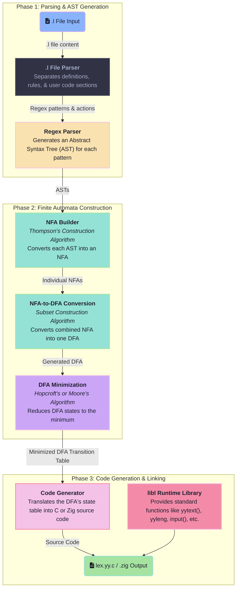

# ft_lex 

> *"Everything is controlled by electrical contacts and relays; I won't give you the details, you know all that. And besides, what's more, the piano really works."* - Boris Vian, L'Écume des jours

Welcome to **ft_lex**, a robust reimplementation of the `lex` utility, written entirely in Zig. Just like Colin's pianocktail, this project transforms regex patterns into token streams. Fully compliant with the POSIX.1-2024 standard.

---

## Table of Contents

* [About The Project](#about-the-project)
* [Architecture](#architecture)
* [Core Features](#core-features)
    * [POSIX Compliance](#posix-compliance)
    * [Internal Design](#internal-design)
    * [Bonus Features](#bonus-features)
* [Quick Start](#quick-start)
    * [Prerequisites](#prerequisites)
    * [Installation](#installation)
* [Usage](#usage)
* [Example .l File](#example-l-file)
* [The 42 Network Perspective](#the-42-network-perspective)
* [Resources](#resources)
* [Contributing](#contributing)
* [Project Status](#project-status)
* [Acknowledgments](#acknowledgments)

---

## About The Project

The `lex` utility is a foundational tool in compiler construction, responsible for lexical analysis. It converts input character streams into token sequences based on regular expression rules.

This from-scratch implementation handles the entire pipeline:

1. Parsing `.l` files containing lexer rules
2. Constructing finite automata from regular expressions
3. Generating C source files (`lex.yy.c`) with state machines for lexical analysis

Written in Zig for performance, safety, and memory control. Output C code is portable and efficient, using minimal standard library functions.

---

## Architecture

Multi-stage pipeline based on compiler theory:


```mermaid
graph TD
    %% --- Catppuccin Mocha Palette Definition ---
    classDef default fill:#313244,stroke:#45475a,stroke-width:2px,color:#a6adc8
    classDef input fill:#89b4fa,stroke:#cba6f7,stroke-width:2px,color:#1e1e2e
    classDef structure fill:#f9e2af,stroke:#f5c2e7,stroke-width:2px,color:#1e1e2e
    classDef final_dfa fill:#cba6f7,stroke:#f5c2e7,stroke-width:2px,color:#1e1e2e
    classDef algo fill:#94e2d5,stroke:#a6e3a1,stroke-width:2px,color:#1e1e2e
    classDef codegen fill:#f5c2e7,stroke:#f38ba8,stroke-width:2px,color:#1e1e2e
    classDef output fill:#a6e3a1,stroke:#94e2d5,stroke-width:2px,color:#1e1e2e
    classDef lib fill:#f38ba8,stroke:#f5c2e7,stroke-width:2px,color:#1e1e2e

    %% --- Diagram Structure ---
    subgraph "Phase 1: Parsing & AST Generation"
        A(fa:fa-file-alt .l File Input):::input -- .l file content --> B["<b>.l File Parser</b><br/>Separates definitions, rules, & user code sections"];
        B -- Regex patterns & actions --> C["<b>Regex Parser</b><br/>Generates an Abstract Syntax Tree (AST) for each pattern"]:::structure;
    end

    subgraph "Phase 2: Finite Automata Construction"
        C -- ASTs --> D["<b>NFA Builder</b><br/><i>Thompson's Construction Algorithm</i><br/>Converts each AST into an NFA"]:::algo;
        D -- Individual NFAs --> E["<b>NFA-to-DFA Conversion</b><br/><i>Subset Construction Algorithm</i><br/>Converts combined NFA into one DFA"]:::algo;
        E -- Generated DFA --> F["<b>DFA Minimization</b><br/><i>Hopcroft's or Moore's Algorithm</i><br/>Reduces DFA states to the minimum"]:::final_dfa;
    end

    subgraph "Phase 3: Code Generation & Linking"
        F -- Minimized DFA Transition Table --> G["<b>Code Generator</b><br/>Translates the DFA's state table into C or Zig source code"]:::codegen;
        G -- Source Code --> H(fa:fa-file-code lex.yy.c / .zig Output):::output;
        L["<b>libl Runtime Library</b><br/>Provides standard functions like yytext(), yyleng, input(), etc."]:::lib
        L --> H
    end

```

---

## Core Features

### POSIX Compliance

* **Extended Regular Expressions (ERE):** Full POSIX ERE syntax support
* **Standard Library (`libl`):** Complete library with all required functions and external variables
* **Scanner Control Functions:** `input()`, `unput()`, `yywrap()`, `yymore()`, and `yyless()`
* **Start Conditions:** Inclusive (`%s`) and exclusive (`%x`) with `BEGIN` macro
* **Context Sensitivity:** Trailing context (`/`) and line anchoring (`^`, `$`)
* **Action Keywords:** Including `REJECT` for subsequent rule matching

### Internal Design

* **Tokenizer & Parser:** Hand-written parser for `.l` format and regex grammar
* **AST Construction:** Rules converted to Abstract Syntax Trees
* **Thompson's Construction:** ASTs transformed to NFAs
* **Subset Construction:** NFAs unified into single DFA
* **DFA Minimization:** Moore's algorithm reduces states to minimum
* **Modular Code Generation:** Template-based system generates only required features

### Bonus Features

* **Zig Scanner Generation**: Generate scanner source in Zig
* **Triple Array Trie Compression**: Reduced memory footprint and improved performance
* **Graph Visualization (`-g` flag)**: Generate `.dot` files for Graphviz

---

## Quick Start

### Prerequisites

* Zig toolchain (version 0.11.0 or later) - [Installation Guide](https://ziglang.org/learn/getting-started/)
* A lot of caffeine ☕

### Installation

1. Clone the repository:
   ```sh
   git clone https://github.com/pix3l-p33p3r/ft_lex.git && cd ft_lex
   ```
2. Build `libl` static library:
   ```sh
   zig build libl
   ```
3. Build `ft_lex` executable:
   ```sh
   zig build
   ```
   Executable available at `./zig-out/bin/ft_lex`

---

## Usage

### Generating a Scanner

1. Create lexer definition file (e.g., `scanner.l`)
2. Generate C source:
   ```sh
   ./zig-out/bin/ft_lex scanner.l
   ```
3. Compile with `libl`:
   ```sh
   cc -o scanner lex.yy.c src/libl/libl.a
   ```
4. Run on input:
   ```sh
   ./scanner < input.txt
   ```

### Command-Line Options

```sh
./zig-out/bin/ft_lex --help
```

The `examples/` directory contains `.l` files demonstrating various features.

---

## Performance Considerations

Certain features significantly impact DFA size and performance:

* `REJECT`, `yymore()`, and trailing context (`/`) substantially increase DFA states
* This is inherent to finite automata handling, consistent with other implementations like `flex`
* Use judiciously in performance-critical applications

---

## Example .l File

Simple arithmetic lexer:

```lex
%{
#include <stdio.h>
%}
%%
[0-9]+      { printf("NUMBER(%s)\n", yytext); }
"+"         { printf("PLUS\n"); }
"-"         { printf("MINUS\n"); }
"*"         { printf("MULTIPLY\n"); }
"/"         { printf("DIVIDE\n"); }
[ \t\n]     { /* ignore whitespace */ }
.           { printf("ERROR: Unexpected character %s\n", yytext); }
%%
int main() {
    yylex();
    return 0;
}
int yywrap() {
    return 1;
}
```

---

## The 42 Network Perspective

This project exemplifies why we learn low-level programming. You're implementing fundamental computer science concepts powering every compiler, interpreter, and parser.

**What you'll learn:**

* Finite automata theory
* Compiler construction techniques
* Memory management in systems programming
* State machine design
* Regex engine internals

**Pro tips:**

* Read POSIX spec carefully
* Test edge cases thoroughly
* Draw state diagrams
* Every bug teaches something

---

## Resources

### Academic Papers

* [Thompson, Ken. "Regular expression search algorithm"](https://www.fing.edu.uy/~caceres/archivos/compilacion/Thompson1968.pdf)
* [Aho, Sethi, Ullman. "Compilers: Principles, Techniques, and Tools"](https://www.pearson.com/us/higher-education/program/Aho-Compilers-Principles-Techniques-and-Tools-2nd-Edition/PGM167067.html) - The Dragon Book

### Online Resources

* [POSIX.1-2024 lex specification](https://pubs.opengroup.org/onlinepubs/9699919799/utilities/lex.html)
* [Zig Documentation](https://ziglang.org/documentation/master/)
* [Regular Expressions: From Theory to Practice](https://swtch.com/~rsc/regexp/) - Russ Cox's series

---

## Contributing

1. Fork the repo
2. Create feature branch (`git checkout -b feature/amazing-feature`)
3. Commit changes (`git commit -m 'Add some amazing feature'`)
4. Push branch (`git push origin feature/amazing-feature`)
5. Open Pull Request

---

## Project Status

Complete. All mandatory 1337 school requirements fulfilled, bonus objectives implemented and tested.

---

## Acknowledgments

* **Boris Vian** for poetic inspiration about pianocktails and finite state transducers
* **Ken Thompson** for regex compilation
* **Zig team** for making systems programming enjoyable
* **42 students** who left wisdom in the halls
* **POSIX.1-2024** and **flex** source as references
* Part of advanced UNIX curriculum at 1337 (42 Network)

### A Fun Note

>  *"There's only one problem," said Colin. "The loud pedal for the whipped egg. I had to put in a special system of interlocking parts because when you play a tune that's too 'hot,' pieces of omelet fall into the cocktail and it's hard to swallow."*

Don't let your regex patterns be too hot, or you might end up with omelet in your token stream!

## _LMAO I'm a poet philosopher too_

>_  $Happy\ lexing!$ _